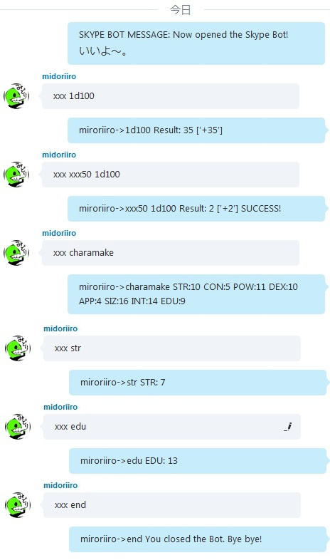
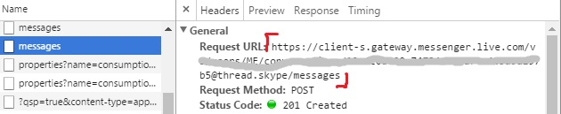
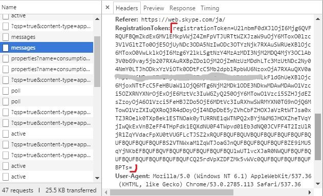

CocSkypeBot
===

Skype Bot for CoC TRPG.

## Setting

Rename SkypeBot.conf.default to SkypeBot.conf in the first time.

### dbPath

    Windows - C:/Users/username/AppData/Roaming/Skype/skypeId
    Mac     - /Users/username/Library/Application Support/Skype/skypeId

### url

Open skype for web page on Chrome. Push F12 and You'll see Developer Tools. Open Network tab. Type something in the chat room where you want to use bot, and then you can find two Message items. Choose the one pointed red sign in the image.

Write Request URL at url.

### token

Scroll downward from Request URL, copy RegistrationToken and paste this long token.

## Usage

Type

    xxx [Command]

## Commands

### help

You can see the help document with command `xxx help`.

### Dice roll

Dice roll format examples.

    1d100
    2d4 -1d4
    1d6 3
    10 -1

### charamake

Make a character status with command `xxx charamake`.

### status

You can roll status with commands

    str con pow dex app siz int edu

### end

Shut down the bot with command `xxx end`.
